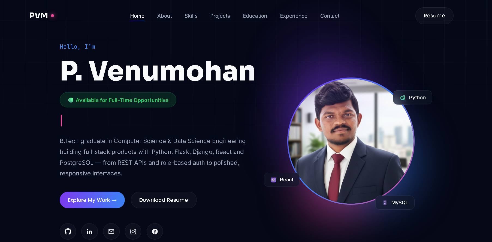
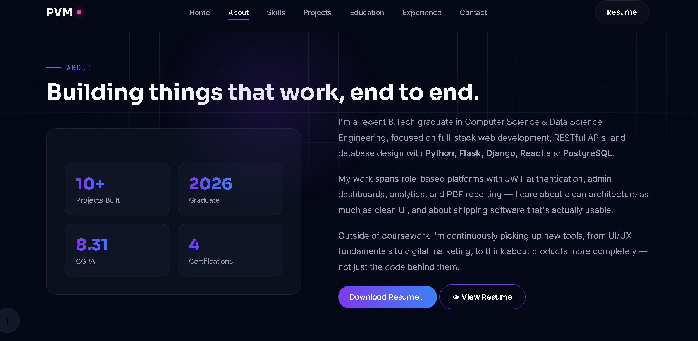
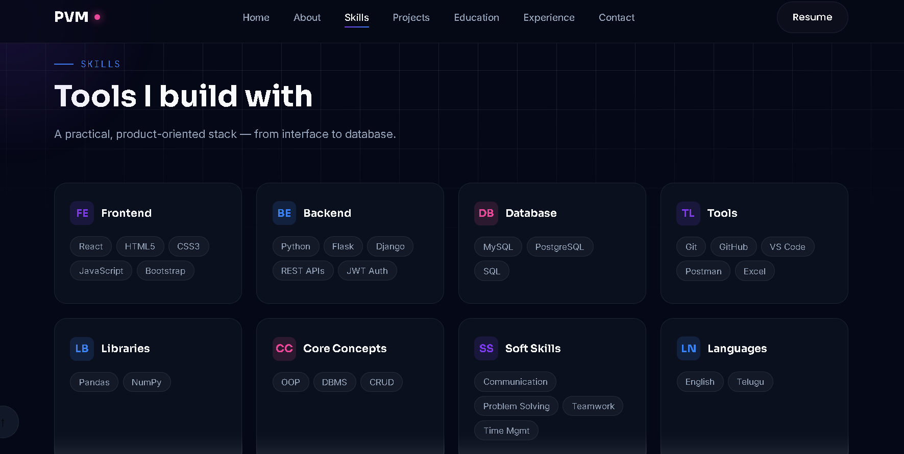
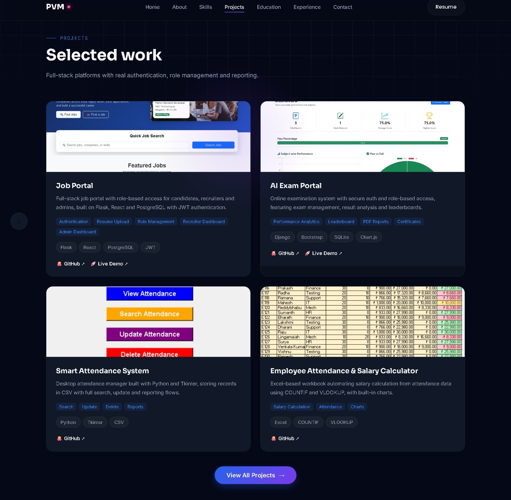
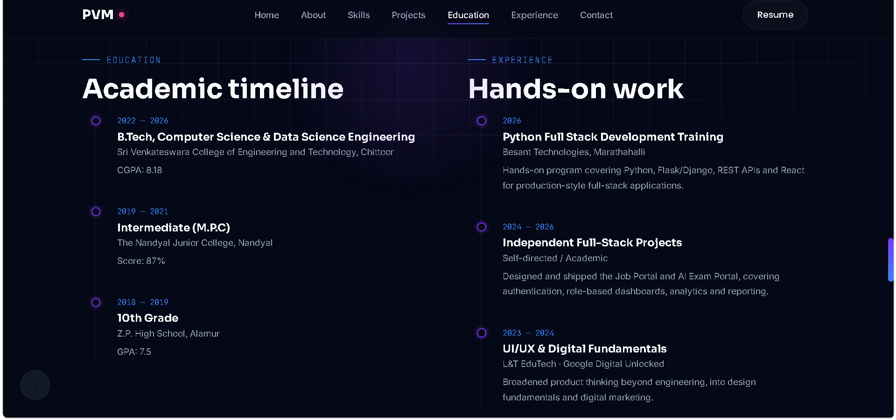
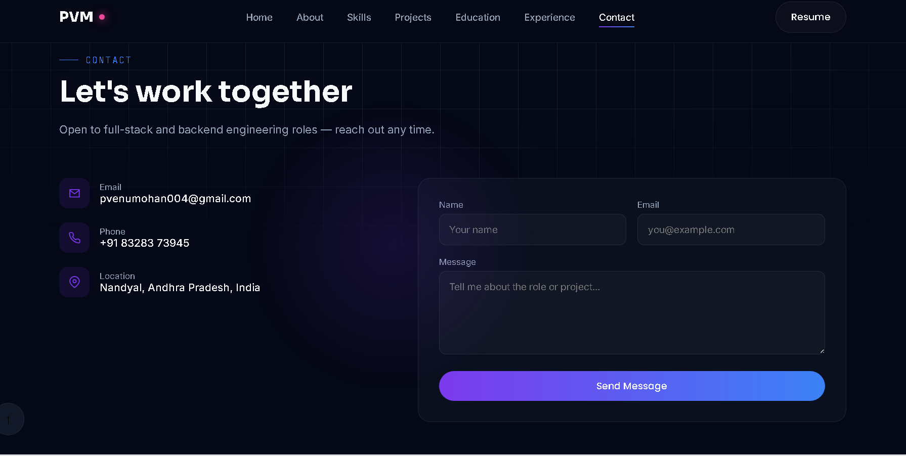

# 🌐 P. Venumohan - Developer Portfolio

<p align="center">
  
</p>

<h1 align="center">P. Venumohan</h1>

<h3 align="center">
Full Stack Developer | Python Developer | Backend Engineer
</h3>

<p align="center">
Building scalable web applications using Python, Flask, Django, React, PostgreSQL, and MySQL.
</p>

---

# 🌍 Live Website

🔗 https://venumohan004.github.io/portfolio-fast/

---

# 📌 About

This repository contains my personal developer portfolio built using HTML, CSS, and JavaScript.

The portfolio highlights my:

- Professional Profile
- Technical Skills
- Projects
- Education
- Experience
- Certifications
- Resume
- Contact Information
- Social Profiles

---

## ✨ Features

- Responsive Design
- Dark Theme
- Modern Glassmorphism UI
- Project Showcase
- Skills Section
- Education Timeline
- Certifications Section
- Resume Download
- Contact Form
- View All Projects
- View All Certificates

---

# 🛠 Built With

## Frontend

- HTML5
- CSS3
- JavaScript (ES6)

## Backend Knowledge

- Python
- Flask
- Django

## Database

- PostgreSQL
- MySQL
- SQL

## Tools

- Git
- GitHub
- VS Code
- Postman

## Libraries

- Google Fonts
- EmailJS

---

# 📂 Folder Structure

```text
Portfolio/
│
├── index.html
├── README.md
│
├── assets
    ├── images
    ├── projects
    ├── resume
    └── screenshots

```

---

# 🚀 Sections

- Home
- About
- Skills
- Projects
- Education
- Experience
- Certifications
- Contact

---

# 📊 Portfolio Statistics

- 🎓 B.Tech CSE (Data Science)
- ⭐ CGPA: 8.31
- 💻 13+ GitHub Repositories
- 🚀 10+ Projects
- 📜 4+ Certifications
- 🛠 15+ Technologies

---

# 💻 Projects

## Job Portal

Technologies

- Python
- Flask
- React
- PostgreSQL

Features

- JWT Authentication
- Resume Upload
- Recruiter Dashboard
- Candidate Dashboard
- Admin Dashboard

---

## AI Exam Portal

Technologies

- Django
- Bootstrap
- SQLite

Features

- Exam Management
- Performance Analytics
- PDF Reports
- Leaderboard

---

## Smart Attendance System

Technologies

- Python
- Tkinter
- SQLite

Features

- Attendance Management
- Search
- Update
- Delete
- Reports

---

## Employee Attendance & Salary Calculator

Technologies

- Microsoft Excel

Features

- Attendance Tracking
- Salary Calculation
- COUNTIF
- VLOOKUP
- Charts

---

## ➡️ More Projects

GitHub Repository

https://github.com/Venumohan004?tab=repositories

---

# 🎓 Education

## Bachelor of Technology

Computer Science and Data Science Engineering

Sri Venkateswara College of Engineering and Technology

CGPA: **8.31**

---

## Intermediate

MPC

87%

---

## SSC

GPA: **7.5**

---

# 💼 Experience

## Python Full Stack Development

Besant Technologies

---

## Independent Projects

- Job Portal
- AI Exam Portal
- Portfolio Website

---

## UI/UX Learning

- L&T EduTech
- Google Digital Unlocked

---

# 🏆 Certifications

- Python Full Stack Development
- Python Programming
- UI/UX Development
- Fundamentals of Digital Marketing

📂 View All Certificates

https://drive.google.com/drive/folders/1dOFvzi3O2iZOCeNkHUMv3D_efhhwPmGG

---

# 📄 Resume

- Download Resume
- View Resume

---

# 📧 Contact

Email

```text
pvenumohan004@gmail.com
```

Phone

```text
+91 8328373945
```

Location

```text
Nandyal
Andhra Pradesh
India
```

---

# 🌐 Social Links

## GitHub

https://github.com/Venumohan004

## LinkedIn

https://linkedin.com/in/venumohan-p-522017346

## Instagram

https://instagram.com/im._.venuuu._.931

## Facebook

https://facebook.com/P.venumohan004

---

## 📸 Screenshots

### Home



### About



### Skills



### Projects



### Education & Experience



### Contact



---

# ⚙ Installation

Clone the repository

```bash
git clone https://github.com/Venumohan004/portfolio-fast.git
```

Navigate to the project folder

```bash
cd portfolio-fast
```

Open

```text
index.html
```

---

# 📦 Deployment

Supported Platforms

- GitHub Pages
- Netlify
- Vercel

---

# 📜 License

This project is licensed under the MIT License.

---

# 👨‍💻 Author

**P. Venumohan**

Full Stack Developer

Email

```text
pvenumohan004@gmail.com
```

Portfolio

https://venumohan004.github.io/portfolio-fast/

GitHub

https://github.com/Venumohan004

LinkedIn

https://linkedin.com/in/venumohan-p-522017346

---

<p align="center">
Made with ❤️ using HTML, CSS and JavaScript
<<<<<<< HEAD
</p>
=======
</p>
>>>>>>> a1aca901f78fbc35e3ca6961e6dfcd5763acc64c
